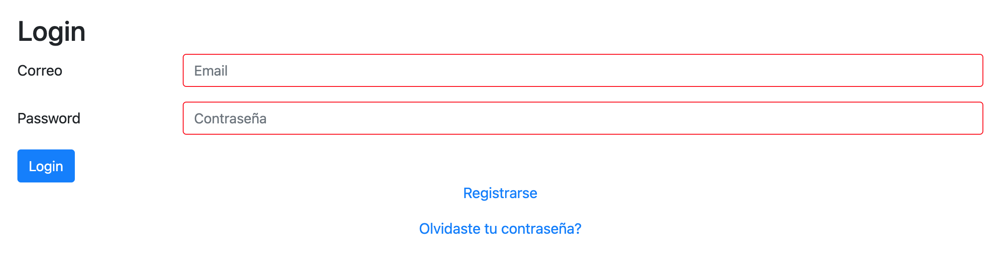
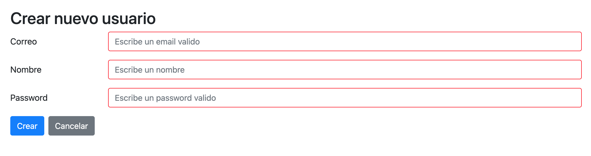

= Manual del Sistema de Inventarios 
:hide-uri-scheme: 

Manual de usuario, donde se explica el uso de la herramienta y las diferentes secciones del sistema de Inventarios.

Para poder ingresar al sistema de debe ir a la siguiente direccion
nota: verificar la url correcta
http://201.116.36.74

== Loggin

Seccion para el acceso de los usuarios, donde deben tener un usuario y contraseña para poder ingresar al sistema.

En caso de no contar con un usuario y contraseña se puede registrar como nuevo usuario en la siguiente imagen.

== Cambio de contraseña

== Alta de usuarios
Para poder dar de alta un usuario es necesario contar con los permisos 

== Lista de usuarios

== Editar usuarios

== Buscar usuarios

== Alta de bienes
Para dar de alta un bien es necesario ingresar a ...

== Lista de bienes
Para mostrar la lista de los bienes es necesario ingresar a ...

== Editar bienes

== Buscar bienes

== Alta de resguardos

== Lista de resguardos

== Editar resguardos

== Buscar resguardos

== Asignar bien a un resguardo

== Quitar bien del resguardo

== Cargar una imagen

== Eliminar una imagen