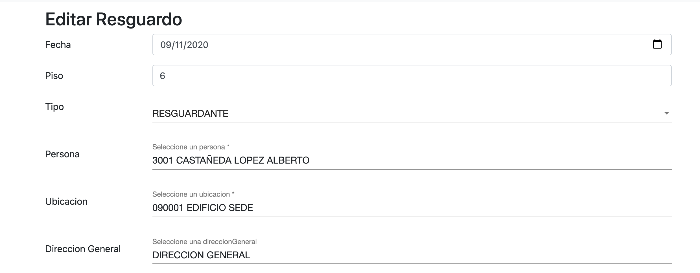

= Manual del Sistema de Inventarios 
:hide-uri-scheme: 

Manual de usuario, donde se explica el uso de la herramienta y las diferentes secciones del sistema de Inventarios.

Para poder ingresar al sistema se debe ir a la siguiente direccion.
nota: revisar la url.
http://201.116.36.74

== Tipos de campos 

Cuando un campo aparce con un contorno rojo significa que tiene que ser llenado obligatoriamente aunque hay veces en las que no aprece asi pero aun asi se tienen que llenar ya que si estos no se llenan no le dejara avanzar a la siguiente ventana, los tipos de campos son los siguentes:

* campo de texto: En este campo solo es necesario llenar lo que se te solicita con letras y/o numeros.

* campo de descripcion: En este campo es necesario que añadas una descripcion corta o larga (ya sea como se te pida), en el apartado seleccionado.

image:campo-de-descripcion.png[campo de descripcion]

* campo de combo: En este campo solo es necesario elegir una opcion de las que se te presentan que siempre son las mismas.

image:campo-de-seleccion.png[campo de seleccion]

* campo de lista: Aqui solo se necesita elegir una de las opciones agregadas, estas opciones pueden aumentar.

* campo de fecha: En este campo solo necesitas poner el dia, mes y año de lo que se te solicita.

* campo de monto: En este campo solo tendras que poner el monto de dinero que tiene que darse o que se va a dar.

== Loggin

Seccion para el acceso de los usuarios, donde deben tener un usuario y contraseña para poder ingresar al sistema.

En caso de no contar con un usuario y contraseña se puede registrar como nuevo usuario en la siguiente imagen.

image:registro.png[Registro]

== Cambio de contraseña

Si olvidaste tu contraseña o quieres cambiarla deberas ingresar tu correo electronico asociado a tu usuario.

Una vez puesto tu correo electronco haz click en enviar. Recibiras un correo electrónico sobre cómo cambiar tu contraseña.

Deberas recibir una notificacion cuando se haya enviado correctamente tu solicitud.

image:aviso-envio-correo.png[Aviso de envio de correo de cambio de contraseña]

 

== Lista de usuarios

Para poder acceder a la lista de usuarios deberas dar click en ¨Administracion¨ luego ¨Usuario¨y despues en ¨Lista¨.

Despues de dar click en ¨Lista¨ te aparecera la lista de usuarios.

== Editar usuarios

Para poder editar tu usuario deberas ir a la lista de usuarios, en la seccion de opciones habra un lapiz azul al que deberas darele click.

Luego accederas a la siguiente pagina donde podras editar tu usuario.

== Buscar usuarios

Para buscar un usuario deberas ir a la parte de ¨Administracion¨despues ¨Usuario¨ y luego ¨Lista¨.

Ahi es donde podras buscar a un usuario ingresando su correo electronico.

== Alta de bienes

Para poder dar de alta un bien tendras que ingresar a la parte de ¨Inventario¨ luego a ¨Bien¨ y luego a ¨Nuevo¨.

Despued te aparece una pagina donde crearas el bien y tendras que llenar algunas caracteristicas acerca del bien que deseas dar de alta.

Una vez que hayas llenado todos los campos que se te solicitan tendras que darle a crear para finalizar y dar de alta el bien.

== Lista de bienes

Para poder mostrar la lista de los bienes tendras que ingresar a la parte de ¨Inventario¨ en ¨Bien´ y despues en ¨Lista¨.

Aqui es donde podras encontrar la lista de bienes.

== Editar bienes

Para editar los bienes tendras que dirigirte a la lista de bienes, ahi tendras que dar click al lapiz azul que se encuentra en la seccion de opciones.

Despued de haber dado click te aparecera la ventana de editar bien donde podras realizar cualquier cambio acerca de las caracteristicas del bien seleccionado.

== Buscar bienes

Cuando quieras buscar cualquier bien deberas ir a la lista de bienes.

Dale click en buscar y podras buscar cualquier bien introduciendo su No Inv.

== Alta de resguardos

Para poder dar de alta un resguardo tendras que ir a la parte de ¨Inventario¨ luego a ¨Resguardo¨ y a ¨Nuevo¨

image:alta-resguardo.png[Alta Resguardo]

Esto te llevara a la parte de crear un resguardo donde tendras que llenar una serie de caracteristicas que se te solicita.

Cuando ya hayas llenado todo lo que se te solicta tendras que dar click en crear para finalizar y guardar el bien creado.

== Lista de resguardos

Para ingresar a la lista de resguardos tendras que dar click en la parte de ¨Inventario¨ luego en ¨Resguardo¨ y a ¨Lista¨.

Una vez hecho esto podras ver la lista de resguardos.

== Editar resguardos

Para poder editar los resguardos tendras que ir a la lista de resguardos en donde le daras click en el lapiz azul para poder editar el resguardo que selecciones.

Cuando hayas dado click te llevara a la ventana donde podras realizar cualquier cambio en las caracteristicas del resguardo seleccionado.

== Buscar resguardos

Si deseas buscar un cualquier resguardo primero dirigete a la lista de resguardos.

Ahi tedras que darle en buscar para poder buscar cualquier resguardo.

== Asignar bien a un resguardo

Para asignar un bien a un resguardo primero tendras que dirigirte a la lista de bienes.

Ahi tendras que dar click en el ojo verde que se encuentra en la parte de opciones del bien que quieras seleccionar.

Despues de esto te debera aparecer la siguiente ventana donde te dejara asignar un bien a un resguardo.

Despues deberas escribir y seleccionar al resguardo al que quieres asignar.

Despues de esto te aparecera un mensaje confirmando si ese es el resguardo que quieres asignar, verifica si esta correcto y si es haci dale en aceptar.

Despues de haber hecho esto quedara asigando el bien al resguardo que hayas seleccionado y listo.

== Quitar bien del resguardo

Para quitar un bien del resguardo tendras y darle click en el ojo verde que encuentra en la parte de opciones.

Cuando le hayas dado click al ojo te aparecera esta ventana donde tendras que volver a darle click en el ojo verde que aparece en el apartado de resguardo al lado del nombre del resguardo.

Una vez hayas dado click te enviara a esta parte donde tendras que darle click en la equis roja que aparece en la seccion de opciones del primero en la lista.

Dandole click a la equis roja aparcera un aviso rectificando si estas seguro de eliminar el bien del resguardo. Verifica si estas seguro de continuar. Cuando hayas aceptado se quedara eliminado.

== Cargar una imagen

Para cargar una imagen en un bien deberas ir a la lista de bienes. Una vez ahi tendras que darle click en el ojo verde del bien que quieras seleccionar.

Despues de esto deberas ir a la parte inferior de la ventana y dar click en el boton que dice ¨Elegir Archivos¨.

Cuando hayas dado click se abrira una ventana que te permitira elegir que imagen quieres agregar. Una vez seleccionada la imagen dale click en abrir.

Y listo, la imagen seleccionada se adjuntara al bien elegido.

Te llegara una notificaion diciendote que la imgen se a subido correctamente.

== Eliminar una imagen

Si quieres eliminar una imagen de un bien, tendras que ir a la lista de bienes, Ahideberas dar click en el ojo verde del bien seleccionado.

Luego tendras que ir a la parte inferior de la pagina y elegir la imagen que deseas eliminar, y darle click al bote de basura negro que aparece a un lado.

Una vez hecho esto la imagen quedara eliminada. Te llegara una notificaion Diciendote que la image se elimino correctamnete.

